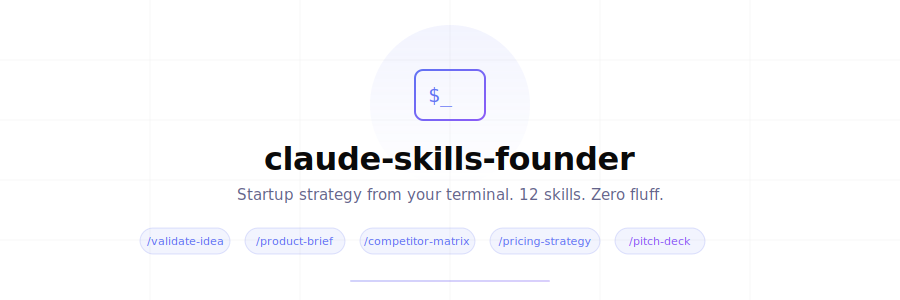

<div align="center">

<picture>
  <source media="(prefers-color-scheme: dark)" srcset="./assets/banner-dark.svg">
  
</picture>

<br />
<br />

**Startup strategy from your terminal. Not another dev tool.**

<br />

<a href="#skills"><strong>Skills</strong></a> ·
<a href="#install"><strong>Install</strong></a> ·
<a href="#usage"><strong>Usage</strong></a> ·
<a href="#philosophy"><strong>Philosophy</strong></a> ·
<a href="#contributing"><strong>Contributing</strong></a>

<br />
<br />

<a href="./LICENSE"></a>
<a href="#skills"></a>
<a href="https://docs.anthropic.com/en/docs/claude-code"></a>
<a href="https://github.com/emotixco/claude-skills-founder/stargazers"></a>

</div>

<br />

> [!NOTE]
> Every Claude Code skills pack out there is developer-focused — code review, git workflows, security audits. **This one is for the founder sitting in a repo at 2am**, trying to figure out if their idea is worth building.

We built these at [Emotix](https://emotix.co?utm_source=github&utm_medium=oss&utm_campaign=claude-skills-founder) while running our own startup. They encode the frameworks, questions, and patterns we wish we had on day one.

<br />

## Skills

<table>
<tr>
<td width="50%">

### Validation & Research

| Command | What it does |
|:--------|:------------|
| `/validate-idea` | Stress-test with 7-dimension scorecard |
| `/product-brief` | Structured brief from one sentence |
| `/competitor-matrix` | Feature comparison + positioning gaps |
| `/persona-gen` | 3 personas with priority matrix |
| `/user-interviews` | Mom Test script + analysis framework |

</td>
<td width="50%">

### Strategy & Growth

| Command | What it does |
|:--------|:------------|
| `/mvp-scope` | Ruthless feature triage |
| `/pricing-strategy` | Tiers, unit economics, psychology |
| `/go-to-market` | Pre-launch to 90-day growth plan |
| `/landing-page` | Conversion copy, section by section |
| `/email-sequence` | Onboarding emails, ready to send |

</td>
</tr>
<tr>
<td colspan="2">

### Fundraising & Metrics

| Command | What it does |
|:--------|:------------|
| `/pitch-deck` | 12-slide outline with per-slide content |
| `/fundraise-prep` | Readiness assessment + investor targeting + 12-week timeline |
| `/metrics-dashboard` | The 5 metrics that actually matter at your stage |

</td>
</tr>
</table>

Every skill takes natural language input and returns structured, actionable output — not generic advice.

<br />

## Install

<details open>
<summary><strong>Option 1 — Add to your project</strong> (recommended)</summary>

<br />

```bash
# From your project root
git clone https://github.com/emotixco/claude-skills-founder.git /tmp/claude-skills-founder
cp -r /tmp/claude-skills-founder/commands/ .claude/commands/founder/
rm -rf /tmp/claude-skills-founder
```

Skills become available as `/founder:product-brief`, `/founder:competitor-matrix`, etc.

</details>

<details>
<summary><strong>Option 2 — Add globally</strong> (available in all projects)</summary>

<br />

```bash
git clone https://github.com/emotixco/claude-skills-founder.git /tmp/claude-skills-founder
cp -r /tmp/claude-skills-founder/commands/ ~/.claude/commands/founder/
rm -rf /tmp/claude-skills-founder
```

</details>

<details>
<summary><strong>Option 3 — Clone and symlink</strong> (auto-updates with git pull)</summary>

<br />

```bash
git clone https://github.com/emotixco/claude-skills-founder.git ~/claude-skills-founder
ln -s ~/claude-skills-founder/commands ~/.claude/commands/founder
```

</details>

<br />

## Usage

Open Claude Code and type any skill with your context:

```bash
> /founder:validate-idea An AI tool that analyzes pitch decks and gives investor-perspective feedback
```

```bash
> /founder:competitor-matrix Project management tools for solo founders (not teams)
```

```bash
> /founder:pricing-strategy B2B SaaS for restaurant inventory, targeting independent restaurants with 1-3 locations
```

```bash
> /founder:pitch-deck Pre-seed raise, $500K, AI competitor analysis for founders, 200 beta users, $2K MRR
```

> [!TIP]
> Be as specific as possible. The more context you give, the better the output. Include your stage, metrics, constraints, and what you've already tried.

<br />

## What each skill produces

<details>
<summary><strong>/validate-idea</strong> — The first skill you should run</summary>

<br />

Scores your idea across 7 dimensions (problem severity, market size, willingness to pay, competition gap, distribution, timing, founder fit) and gives a verdict: **build**, **pivot**, or **kill**.

Includes 3 specific validation experiments you can run in under 2 weeks for under $200.

</details>

<details>
<summary><strong>/product-brief</strong> — From idea to structured document</summary>

<br />

Turns a one-sentence idea into a structured brief: problem statement, target audience with personas, value proposition, MVP features (exactly 5-7), success metrics with 90-day targets, risk assessment, and GTM snapshot.

</details>

<details>
<summary><strong>/competitor-matrix</strong> — Know your market</summary>

<br />

Identifies 5-8 competitors and builds a feature comparison table. Finds positioning gaps no one is filling, ranks threats, and recommends a niche to own.

</details>

<details>
<summary><strong>/persona-gen</strong> — Real people, not demographics</summary>

<br />

Creates 3 distinct personas with day-in-the-life narratives, direct quotes, current workarounds, and decision-making patterns. Includes a priority matrix showing which persona to build for first.

</details>

<details>
<summary><strong>/mvp-scope</strong> — Cut ruthlessly</summary>

<br />

Takes your feature wishlist and triages into Must Have / Should Have / Won't Have. Defines the critical user flow (signup to value in under 5 steps), recommends a tech stack, and estimates build time for a solo developer.

</details>

<details>
<summary><strong>/pricing-strategy</strong> — Beyond "just charge more"</summary>

<br />

Evaluates 6 pricing models, designs 3 tiers with specific prices and features, checks unit economics, and applies pricing psychology (anchoring, decoy effect, annual framing). Includes launch vs. scale pricing and grandfathering policy.

</details>

<details>
<summary><strong>/go-to-market</strong> — Week-by-week launch plan</summary>

<br />

Pre-launch audience building, launch day platform strategy (Product Hunt, HN, Reddit, Twitter/X, LinkedIn), and 90-day post-launch growth with channel prioritization. Budget allocation for $0-$500/month.

</details>

<details>
<summary><strong>/pitch-deck</strong> — Investor-ready structure</summary>

<br />

12-slide outline with exact content for each slide: title, problem, solution, demo, market size, traction, business model, competition, GTM, team, the ask, and closing. Plus appendix slides for Q&A.

</details>

<details>
<summary><strong>/fundraise-prep</strong> — Are you actually ready?</summary>

<br />

Readiness scorecard, round sizing with recommended instrument (SAFE, note, or priced round), investor targeting with a 50-investor pipeline framework, materials checklist, and a 12-week fundraising timeline.

</details>

<details>
<summary><strong>/landing-page</strong> — Copy that converts</summary>

<br />

Complete copy for every section: hero (headline, subhead, CTA), problem, solution, how it works, social proof, pricing preview, FAQ, and final CTA. Includes SEO metadata. Written for conversion, not cleverness.

</details>

<details>
<summary><strong>/user-interviews</strong> — Ask the right questions</summary>

<br />

Interview script following The Mom Test methodology — no leading questions, no hypotheticals. Includes screening criteria, problem exploration, solution exploration, and a reaction phase. Analysis framework for synthesizing 5-8 interviews.

</details>

<details>
<summary><strong>/metrics-dashboard</strong> — Five metrics, not fifty</summary>

<br />

Defines exactly 5 metrics tailored to your stage (not 15 vanity metrics). Each has a definition, target, and specific action if below target. Weekly review template + investor-ready benchmarks.

</details>

<details>
<summary><strong>/email-sequence</strong> — Ready to send</summary>

<br />

5-7 emails for onboarding or re-engagement. Complete copy: subject line with A/B variant, preview text, body under 150 words, and one CTA. Timing, segmentation, and performance benchmarks included.

</details>

<br />

## Philosophy

<table>
<tr>
<td width="25%" align="center">

**Specific**

"Post a Show HN on Tuesday at 9am ET" — not "post on social media"

</td>
<td width="25%" align="center">

**Opinionated**

"Kill this feature" — not "consider deprioritizing"

</td>
<td width="25%" align="center">

**Brief**

Every skill has a word limit. Brevity forces clarity.

</td>
<td width="25%" align="center">

**Structured**

Scorecards, matrices, checklists — not walls of text.

</td>
</tr>
</table>

<br />

## Contributing

Have a skill idea? [Open an issue](https://github.com/emotixco/claude-skills-founder/issues) or submit a PR.

**To add a new skill:**

1. Create a `.md` file in `commands/`
2. Add YAML frontmatter with `description` and `argument-hint`
3. Write clear instructions with sections, rules, and output format
4. Keep the expected output under 2000 words
5. Test with 3 different inputs to make sure it generalizes

> [!IMPORTANT]
> We're looking for skills that fill genuine gaps in the founder workflow — not developer tools repackaged with startup vocabulary.

<br />

## License

[MIT](./LICENSE) — use these however you want.

<br />

---

<div align="center">

<br />

Built by the <a href="https://emotix.co?utm_source=github&utm_medium=oss&utm_campaign=claude-skills-founder">Emotix</a> team

We build AI agents that turn startup ideas into research, analysis, and product briefs.

<br />

<a href="https://emotix.co?utm_source=github&utm_medium=oss&utm_campaign=claude-skills-founder">Website</a> ·
<a href="https://github.com/emotixco">GitHub</a> ·
<a href="https://x.com/emotixco">Twitter</a>

<br />
<br />

</div>
